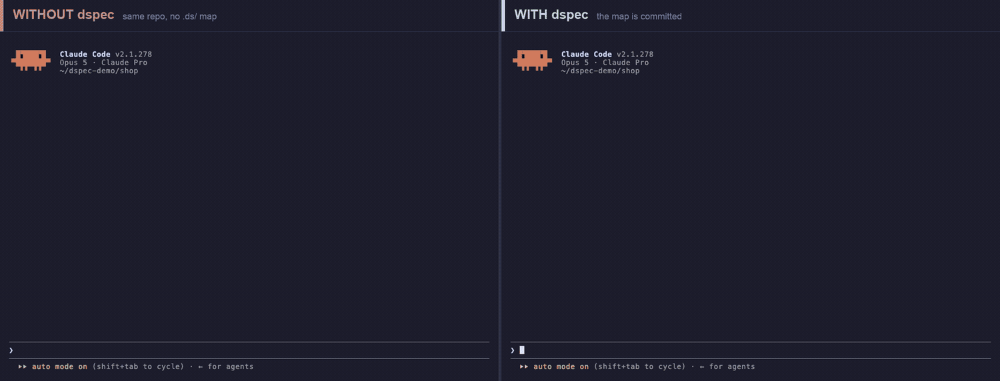

<h1 align="center">dspec</h1>

<p align="center">
  <strong>Your agent answers from what your product is — not from what it can grep.</strong>
</p>

<p align="center">
  Write it down once in <code>.ds/</code> — a form built to be read fast:<br>
  one page to find the feature, one file to understand it.
</p>

<p align="center">
  <a href="https://www.npmjs.com/package/dspec"></a>
  <a href="LICENSE"></a>
  
  
</p>

<p align="center">
  
</p>

<p align="center">
  <em>Two real Claude Code sessions. Same repository, same question, same model.<br>
  Left matched a word and opened everything that mentioned it. Right read the map and opened<br>
  the two files the feature actually lives in. The only difference is whether <code>.ds/</code> is committed.</em>
</p>

```bash
npm i -g dspec
dspec init
```

Then, in Claude Code, Codex or Cursor:

```
/ds-bootstrap
```

That's it. That's the whole tool.

---

## The problem

You ask your agent a question about your own code. It has no idea what your product is, so it goes
looking for one:

```
Grep "discount"            → 47 hits across 23 files
Glob "src/**/*.ts"         → 312 files
Read src/checkout/index.ts
Read src/checkout/cart.ts
Read src/pricing/rules.ts
Read 6 more files…
```

Every one of those files mentions the word. None of them says which one *is* the feature, and a
search can't tell the difference — so the agent picks, reads, and assembles an answer out of
whatever happened to share a word with your question.

Then the harder half. You didn't ask where discounts live; you asked **why checkout rejects your
second code**. That's a decision somebody made once, and no file states it. The code shows a
branch; it doesn't say which failure the branch exists to prevent. So the agent infers — fluently,
in the same confident voice as the parts it genuinely read — and nothing in the answer marks the
inference as one.

That's the real bill. Not the tokens: the fact that you now have to go read the code yourself to
work out which sentence to believe.

`CLAUDE.md` was supposed to fix this. It usually doesn't: someone writes it once, the code moves
on, and nothing tells you it's now wrong.

## What dspec does

`/ds-bootstrap` reads your codebase **once** and writes down what it found:

```
.ds/
  index.md         every feature: what it is, which files it lives in, what it depends on
  features/*.md    one file per feature — what it does, and why
  product.md       what the product is, and the rules that apply everywhere
```

`dspec init` adds a short instruction block to `CLAUDE.md` / `AGENTS.md` — the file your agent
already reads at the start of every session — telling it to use that map first.

Now the same question goes:

```
Read .ds/index.md                     → "Apply discount" lives in src/pricing/discount.ts
Read .ds/features/apply-discount.md   → what it does, and why it refuses a second code
Read src/pricing/discount.ts          → the actual code
```

Three reads. No search. And the *why* is already answered, because the session that wrote that
file had read the code and put the reason down in a sentence. Rules, refusals, the case that must
never break — the knowledge that makes an answer correct, not merely fast.

## Why you can believe the answer

A map that guesses is worse than no map, because every later session will trust it. So the
instructions dspec installs are built to stop that happening, in four specific ways.

**Nothing is claimed from a name.** Where a feature lives and what it depends on are recorded from
reading the files — never inferred from an import list, a directory name, or a word two files
happen to share. The kind of connection a grep would have offered is exactly the kind that isn't
allowed in.

**Nothing is described unread.** An agent bringing the map up to date may not rewrite a description
of code it hasn't opened. That is the one failure that compounds: a confident sentence about code
nobody read gets inherited by every session afterwards, each one equally sure.

**The map checks itself.** Once written, every path is verified to exist, every dependency to name
a feature that exists, and no file of consequence to be left unclaimed — anything unclaimed is
either misfiled or a feature that was missed.

**The code always wins.**

> **If `.ds/` and the code disagree, the code wins.**

Your agent updates the feature file for whatever it just changed, as part of the work, not as a
ceremony afterwards. After a big refactor — or a stretch of work by someone who wasn't using this
— `/ds-bootstrap` rebuilds the whole thing. And because `.ds/` is plain markdown committed to your
repo, a wrong belief surfaces in code review like anything else, before it becomes the thing every
future session is certain about.

There's one more thing the map carries: **your words**. The terms your team actually uses, and what
each one means in this repository. Ask about "the discount" and your agent resolves the word to the
feature you meant — not to all 47 files that spell it.

## And it's cheaper, too

The map is written once and read many times. A feature file is a few hundred tokens; the search it
replaces is tens of thousands — on every question, in every new session, for every person on your
team.

The recording above, measured. One question — *why does checkout reject my second discount code?* —
put to Claude Code twice, in the same repository, once with `.ds/` committed and once without:

| | answered in | tokens through the context | cost |
|---|---|---|---|
| without dspec | 45s | 127,814 | $0.32 |
| with dspec | 29s | 67,436 | $0.19 |

One run each, on the 15-file demo repository in [`demo/shop`](demo/) — clone it and check.

What that table measures is time, tokens and cost. Correctness isn't a number here; what stands in
for it is the line above the table — which files each session chose to open. The cost gap grows
with the repository, too: the map stays a few thousand tokens while the search it replaces grows
with every file you add.

## One person sets it up; the team gets it

`.ds/` and the instruction block are committed, like any other file. So the developer who runs
`/ds-bootstrap` isn't the one who benefits from it — everyone who pulls does, in their very next
session, without installing anything or being told.

That's also how the map stays honest across a team. Nobody has to remember to update it: whoever
touches the code has an agent that was already told to fix the feature file it just invalidated.

## dspec is not a workflow

No spec to write. No plan to approve. No gate to pass. No process to adopt.

dspec doesn't change how you work — it makes your agent better informed at whatever you already
do. `.ds/` is just knowledge: where things are, and why.

## The two surfaces

| Where | What |
|---|---|
| **Terminal** | `dspec init` — installs the command into every agent it supports, and writes the instruction block |
| **Your agent** | `/ds-bootstrap` — builds the map, or brings it up to date |

**It asks nothing.** One `dspec init` sets up all three:

| Agent | Command lands at | Reads |
|---|---|---|
| Claude Code | `.claude/commands/ds-bootstrap.md` | `CLAUDE.md` |
| Codex CLI | `~/.codex/prompts/ds-bootstrap.md` | `AGENTS.md` |
| Cursor | `.agents/skills/ds-bootstrap/SKILL.md` | `AGENTS.md` |

Installing an agent you never open costs you one markdown file. *Not* installing the one you do
open costs you a session where `/ds-bootstrap` isn't there and nothing says why — so dspec makes
the cheap mistake, and you don't have to predict which agent you or a teammate will reach for.

Codex only reads prompts from your home directory, so its command isn't shared when a teammate
clones the repo — they run `dspec init` once themselves.

Want fewer? `dspec init --agent claude` installs only that one, and uninstalls any other that
keeps its files in this repository.

## What it won't do

- **Call the network.** Ever. No server, no account, no token, no telemetry, not even a version
  check. Upgrading is `npm`'s job.
- **Install dependencies.** Node 20+, and nothing else.
- **Touch a file it didn't write.** Every file dspec installs is marked; `dspec init` deletes only
  marked files before writing them again. In `CLAUDE.md` / `AGENTS.md` it owns only the block
  between `<!-- ds:begin -->` and `<!-- ds:end -->` — every other byte is yours.
- **Read your codebase.** `dspec init` installs files and nothing more. Deciding what your features
  are takes judgement, and that's your agent's job, not a CLI's.

## Upgrading

```bash
npm i -g dspec@latest
dspec init          # rebuilds what dspec installed, from the new version
```

Start a new agent session afterwards so it picks up the rebuilt command.

<details>
<summary><strong>Coming from 0.1.x?</strong></summary>

0.2.0 removed everything that made dspec a workflow: the `/ds` and `/ds-update` commands, the
session hooks, and the `dspec sync | spec | accept | update` verbs, along with code fingerprints,
drift detection and the linter.

One `dspec init` removes every trace of them, including the hook entries the old version left in
`.claude/settings.json`. Your existing `.ds/` still reads fine — run `/ds-bootstrap` when
convenient to bring it to the simpler format. Full detail in the [changelog](CHANGELOG.md).

</details>

## Contributing

See [CONTRIBUTING.md](CONTRIBUTING.md). The whole program is about a thousand lines, and it does
one thing.

## License

MIT
